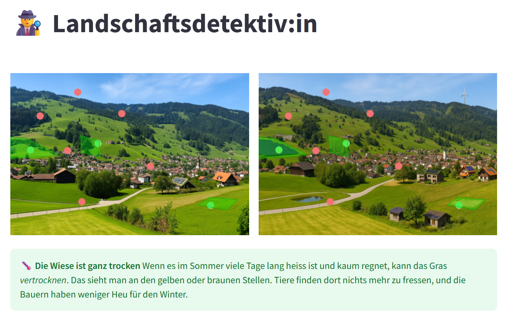

# 🌱 Landschaft erleben – Interaktive Wissenskommunikationstools (WKT)

Willkommen bei **Landschaft erleben**!  
Diese Plattform vereint interaktive Lernspiele und Visualisierungstools, die spielerisch Wissen zu Klimawandel, Landschaftsentwicklung und Biodiversität vermitteln. Unsere Games richten sich an ein breites Publikum – von Schüler:innen über Studierende bis zu Fachleuten und allen Interessierten.

---

## 🕹️ Games

- **Landschaftsbeschützer:in**
  ➡️ Streife durch Ebnat-Kappel wie in einem Pokémon-Spiel – entdecke markante Orte, sammle Wissen über heimische Pflanzen und kämpfe gegen invasive Arten (Neobiota) wie das Drüsige Springkraut oder die Goldrute!

- **Landschaftsdetektiv:in**  
  ➡️ Finde die Unterschiede! Spieler:innen erkunden Bildpaare von Landschaften und lernen dabei, wie sich Umweltveränderungen sichtbar machen lassen.
  
- **Landschaftsdesigner:in**  
  ➡️ Experimentiere mit Schiebereglern, um verschiedene Szenarien einer Landschaft zu simulieren und zu sehen, wie sich Parameter wie Vegetation oder Infrastruktur verändern.

- **Auswertung**  
  ➡️ Visualisiere die Ergebnisse aus den Spielen und erfahre, wie das Publikum interagiert hat. Hier kannst du deine Ergebnisse auswerten und Feedback einholen (nur mit Passwortschutz zugänglich).

---

## 🚀 Aufbau & Technik

- **Streamlit** als Frontend-Framework für eine intuitive, webbasierte Nutzeroberfläche.
- **Pandas** und **Geopandas** für Datenanalyse und Geodatenverarbeitung.
- **Pillow (PIL)** und **Matplotlib** für Bildverarbeitung und Visualisierung.
- **Google Sheets** für die Speicherung und Auswertung von Spielergebnissen.
- **Shapely** für die Geometrieberechnungen (z.B. Differenzpolygone).

---

## 📸 Screenshots




---

## 🔐 Passwortschutz

Bestimmte Bereiche (z.B. die Auswertung) sind passwortgeschützt, um sensible Ergebnisse zu schützen.

---

## 🚀 Installation & Start

1. Repository klonen:
   ```bash
   git clone https://github.com/SeverinHitz/Learnlit.git
   cd landschaft-erleben
    ````

2. Virtuelle Umgebung aktivieren:

   ```bash
   conda activate PWLE  # oder dein venv
   ```
3. Abhängigkeiten installieren:

   ```bash
   pip install -r requirements.txt
   ```
4. Streamlit starten:

   ```bash
   streamlit run Start.py
   ```

---

## 🛠️ Projektstruktur

```
.
├── data/
│   └── ...
├── pages/
│   ├── Landschaftsdetektiv.py
│   ├── Landschaftsdesigner.py
│   └── Auswertung.py
├── utils/
│   ├── detective_utils.py
│   └── ...
├── tests/
│   └── ...
├── Start.py
├── requirements.txt
└── README.md
```

---

## 📜 Lizenz

Dieses Projekt ist Open Source und steht unter der MIT-Lizenz.


---

*Diese Readme wurde zuletzt am \[05.06.2025] aktualisiert.*


